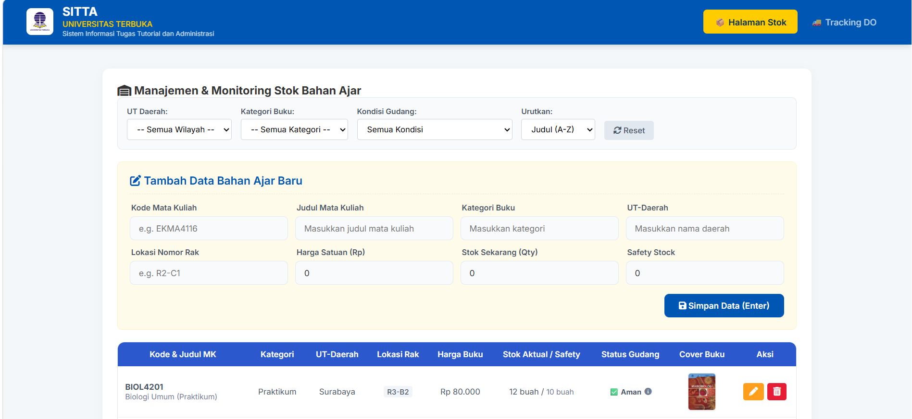

# SITTA UT - Sistem Pemesanan & Monitoring Bahan Ajar

SITTA UT (Sistem Informasi Tugas Tutorial dan Administrasi) adalah aplikasi berbasis web yang dirancang khusus untuk mempermudah manajemen, monitoring stok, serta pelacakan (*tracking*) distribusi Bahan Ajar digital maupun fisik di lingkungan Universitas Terbuka (UT) Daerah.

Aplikasi ini dibangun menggunakan arsitektur modern yang ringan dengan memanfaatkan **Vue.js 2** untuk interaktivitas dinamis pada sisi *front-end*.

---

## 📸 Antarmuka Aplikasi

Berikut adalah tampilan utama dari sistem manajemen dan monitoring bahan ajar SITTA UT:



---

## ✨ Fitur Utama

Aplikasi ini dilengkapi dengan fitur-fitur utama yang mendukung efisiensi operasional administrasi bahan ajar, antara lain:

1. **Manajemen & Monitoring Stok Bahan Ajar**
   * Pencatatan data bahan ajar berdasarkan Kode & Judul Mata Kuliah.
   * Pengelompokan wilayah berdasarkan UT Daerah (UPBJJ) dan Kategori Buku.
   * Fitur *Safety Stock Alert*: Sistem otomatis memberikan penanda visual jika stok aktual berada di bawah batas aman (*Safety Stock*).
   * Operasi CRUD (Create, Read, Update, Delete) data stok secara *real-time*.

2. **Tracing & Tracking Delivery Order (DO)**
   * Pencarian status pengiriman menggunakan Nomor DO atau NIM Mahasiswa.
   * *Timeline* perjalanan paket kurir yang interaktif dan informatif.
   * Pembuatan (*Input*) dokumen DO baru dilengkapi dengan fitur paket *bundling* modul dan kalkulasi total harga otomatis.
   * Riwayat log manifes yang dapat diperbarui kapan saja oleh petugas.
     
---

## 🛠️ Struktur Direktori Proyek

```text
├── assets/
│   ├── logo_univ.jpeg      # Logo Universitas Terbuka
│   └── sita_vue.png        # Screenshot antarmuka aplikasi
├── css/
│   └── style.css           # Styling utama aplikasi (Navbar, Card, Table, Timeline)
├── js/
│   ├── components/
│   │   ├── do-tracking.js  # Komponen Vue untuk pelacakan pengiriman
│   │   ├── status-badge.js # Komponen Vue untuk badge kondisi gudang
│   │   └── stock-table.js  # Komponen Vue untuk manajemen stok buku
│   ├── services/
│   │   └── api.js          # Service integrasi data / API pendukung
│   ├── api.js              # Inisialisasi API core
│   └── app.js              # Konfigurasi dan mounting Utama Vue Instance
├── index.html              # File HTML utama (Template komponen Vue)
└── README.md               # Dokumentasi proyek
